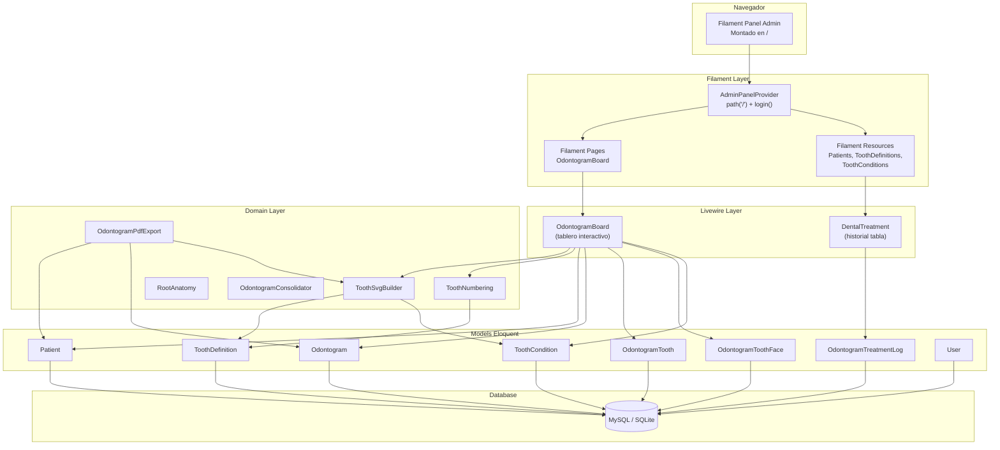
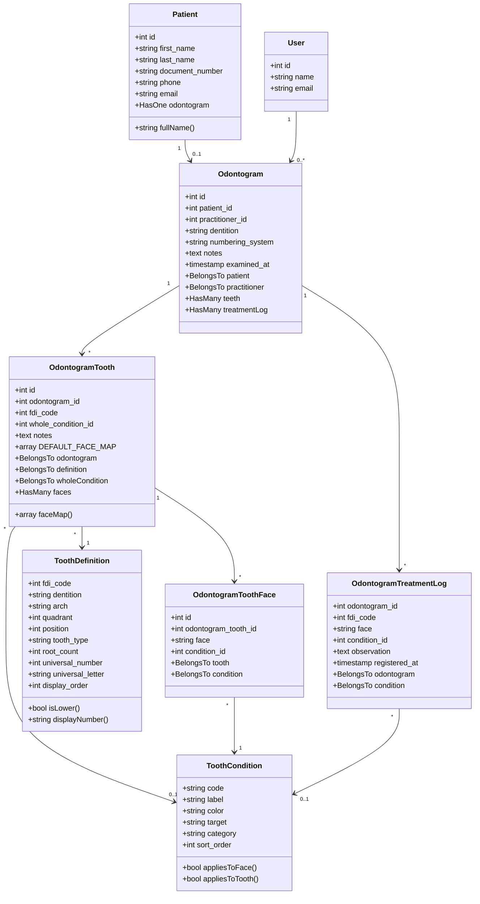
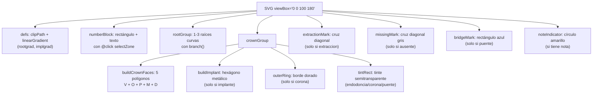
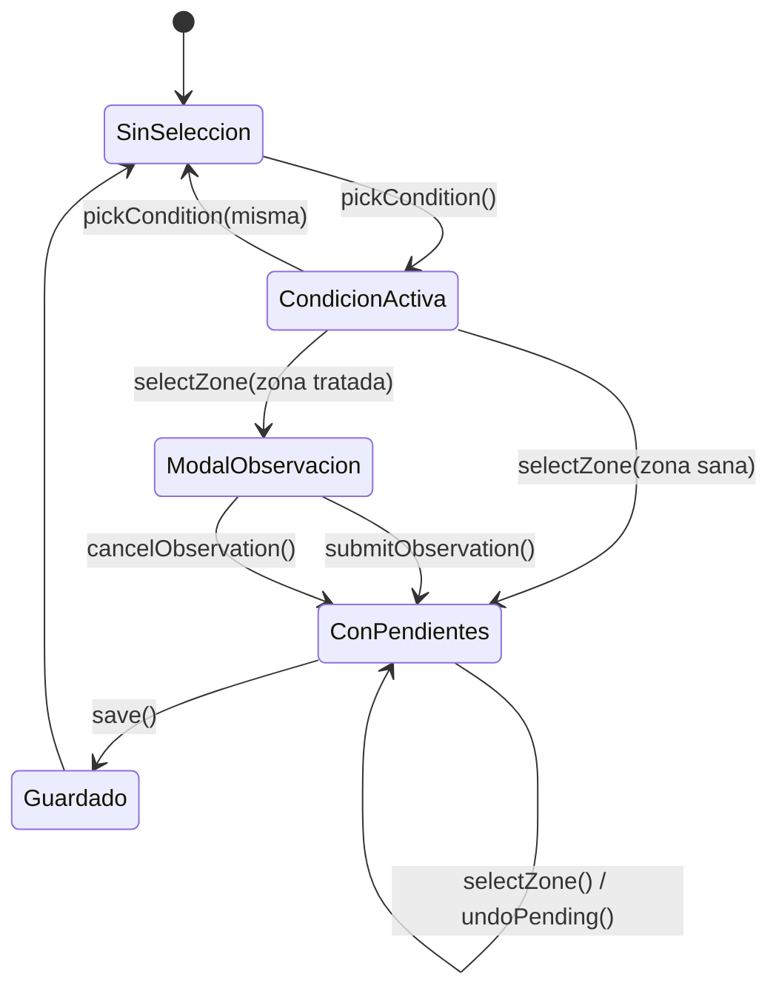
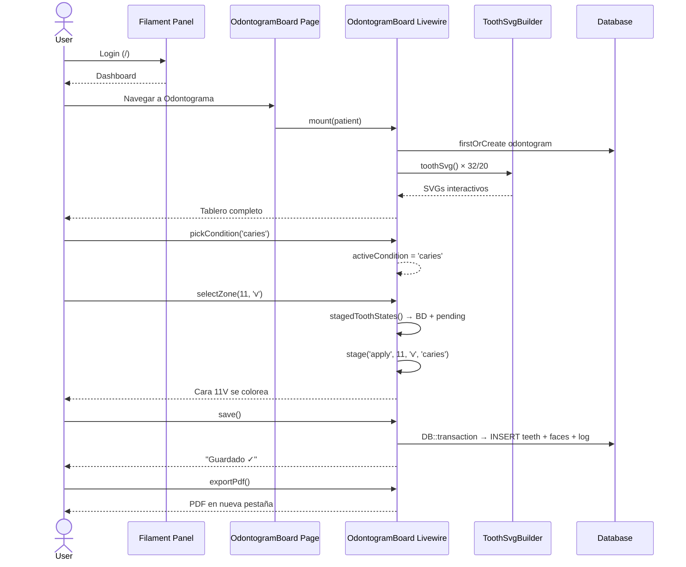
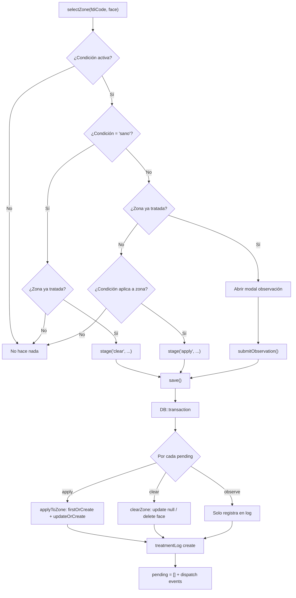

# Odontograma — Guía de Implementación Completa del Sistema

Sistema de odontograma dental construido con **Laravel 13**, **Filament v5**, **Livewire v4** y **Tailwind v4**. Permite a los odontólogos registrar el estado dental de cada paciente mediante un tablero interactivo con SVG, persistiendo tratamientos y generando exportaciones PDF.

---

## Tabla de contenidos

1. [Stack tecnológico](#1-stack-tecnológico)
2. [Arquitectura general](#2-arquitectura-general)
3. [Árbol de archivos del proyecto](#3-árbol-de-archivos-del-proyecto)
4. [Modelo de datos (ER)](#4-modelo-de-datos-er)
5. [Relaciones entre modelos](#5-relaciones-entre-modelos)
6. [Capa de Dominio — `app/Domain/`](#6-capa-de-dominio--appdomain)
7. [Modelos Eloquent — `app/Models/`](#7-modelos-eloquent--appmodels)
8. [Enum — `app/Enum/`](#8-enum--appennum)
9. [Livewire Components — `app/Livewire/`](#9-livewire-components--applivewire)
10. [Filament Resources — `app/Filament/Resources/`](#10-filament-resources--appfilamentresources)
11. [Filament Pages — `app/Filament/Pages/`](#11-filament-pages--appfilamentpages)
12. [Providers — `app/Providers/`](#12-providers--appproviders)
13. [Controllers — `app/Http/Controllers/`](#13-controllers--apphttpcontrollers)
14. [Migraciones — `database/migrations/`](#14-migraciones--databasemigrations)
15. [Seeders — `database/seeders/`](#15-seeders--databaseseeders)
16. [Factories — `database/factories/`](#16-factories--databasefactories)
17. [Vistas Blade — `resources/views/`](#17-vistas-blade--resourcesviews)
18. [CSS / Tema — `resources/css/`](#18-css--tema--resourcescss)
19. [Rutas — `routes/`](#19-rutas--routes)
20. [Bootstrap — `bootstrap/`](#20-bootstrap--bootstrap)
21. [Configuración — `config/`](#21-configuración--config)
22. [Build & Assets — `vite.config.js`, `package.json`](#22-build--assets--viteconfigjs-packagejson)
23. [Tests — `tests/`](#23-tests--tests)
24. [Flujos de usuario](#24-flujos-de-usuario)
25. [Instalación](#25-instalación)

---

## 1. Stack tecnológico

| Capa | Tecnología | Versión |
|------|-----------|---------|
| Backend | Laravel | 13.x |
| PHP | PHP | 8.5 |
| Panel admin | Filament | 5.7 |
| Componentes UI | Livewire | 4.x |
| CSS | Tailwind CSS | 4.x |
| Build tool | Vite | 8.x |
| Tests | Pest | 5.x |
| PDF | PhpPdf (DragonOfMercy) | 1.12 |
| Base de datos | MySQL (prod) / SQLite (tests) | — |

---

## 2. Arquitectura general



---

## 3. Árbol de archivos del proyecto

```
odontograma/
│
├── app/
│   ├── Domain/Odontogram/
│   │   ├── OdontogramConsolidator.php    # Fusiona odontogramas duplicados
│   │   ├── OdontogramPdfExport.php       # Genera PDF del odontograma
│   │   ├── RootAnatomy.php               # Número de raíces por pieza FDI
│   │   ├── ToothNumbering.php            # Conversión FDI ↔ Universal
│   │   └── ToothSvgBuilder.php           # Genera SVG interactivo por diente
│   │
│   ├── Enum/
│   │   └── PatientSex.php                # Enum Masculino/Femenino/Otro
│   │
│   ├── Filament/
│   │   ├── Pages/
│   │   │   └── OdontogramBoard.php       # Página principal del odontograma
│   │   └── Resources/
│   │       ├── Patients/
│   │       │   ├── PatientResource.php   # Resource CRUD pacientes
│   │       │   ├── Pages/
│   │       │   │   ├── CreatePatient.php
│   │       │   │   ├── EditPatient.php
│   │       │   │   └── ListPatients.php
│   │       │   ├── Schemas/
│   │       │   │   └── PatientForm.php   # Formulario de paciente
│   │       │   └── Tables/
│   │       │       └── PatientsTable.php # Tabla de pacientes
│   │       ├── ToothConditions/
│   │       │   ├── ToothConditionResource.php
│   │       │   ├── Pages/
│   │       │   │   ├── CreateToothCondition.php
│   │       │   │   ├── EditToothCondition.php
│   │       │   │   └── ListToothConditions.php
│   │       │   ├── Schemas/
│   │       │   │   └── ToothConditionForm.php
│   │       │   └── Tables/
│   │       │       └── ToothConditionsTable.php
│   │       └── ToothDefinitions/
│   │           ├── ToothDefinitionResource.php
│   │           ├── Pages/
│   │           │   ├── CreateToothDefinition.php
│   │           │   ├── EditToothDefinition.php
│   │           │   └── ListToothDefinitions.php
│   │           ├── Schemas/
│   │           │   └── ToothDefinitionForm.php
│   │           └── Tables/
│   │               └── ToothDefinitionsTable.php
│   │
│   ├── Http/Controllers/
│   │   ├── Controller.php                # Controller base abstracto
│   │   └── OdontogramPdfController.php   # Ruta de exportación PDF
│   │
│   ├── Livewire/
│   │   ├── DentalTreatment.php           # Tabla historial de tratamientos
│   │   └── OdontogramBoard.php           # Tablero interactivo principal
│   │
│   ├── Models/
│   │   ├── Odontogram.php
│   │   ├── OdontogramTooth.php
│   │   ├── OdontogramToothFace.php
│   │   ├── OdontogramTreatmentLog.php
│   │   ├── Patient.php
│   │   ├── ToothCondition.php
│   │   ├── ToothDefinition.php
│   │   └── User.php
│   │
│   └── Providers/
│       ├── AppServiceProvider.php
│       └── Filament/
│           └── AdminPanelProvider.php    # Configuración del panel Filament
│
├── bootstrap/
│   ├── app.php                           # Configuración de la aplicación Laravel
│   └── providers.php                     # Registro de service providers
│
├── config/
│   ├── app.php
│   ├── auth.php
│   ├── cache.php
│   ├── database.php
│   ├── filesystems.php
│   ├── logging.php
│   ├── mail.php
│   ├── queue.php
│   ├── services.php
│   └── session.php
│
├── database/
│   ├── factories/
│   │   ├── OdontogramFactory.php
│   │   ├── PatientFactory.php
│   │   ├── ToothConditionFactory.php
│   │   ├── ToothDefinitionFactory.php
│   │   └── UserFactory.php
│   ├── migrations/
│   │   ├── 0001_01_01_000000_create_users_table.php
│   │   ├── 0001_01_01_000001_create_cache_table.php
│   │   ├── 0001_01_01_000002_create_jobs_table.php
│   │   ├── 2026_08_12_235113_create_patients_table.php
│   │   ├── 2026_08_13_135121_create_tooth_definitions_table.php
│   │   ├── 2026_08_13_135207_create_tooth_conditions_table.php
│   │   ├── 2026_08_13_135224_create_odontograms_table.php
│   │   ├── 2026_08_13_135243_create_odontogram_teeth_table.php
│   │   ├── 2026_08_13_135252_create_odontogram_tooth_faces_table.php
│   │   ├── 2026_08_18_141841_create_odontogram_treatment_log_table.php
│   │   └── 2026_08_18_141842_make_patient_id_unique_on_odontograms.php
│   └── seeders/
│       ├── DatabaseSeeder.php
│       ├── ToothConditionSeeder.php
│       └── ToothDefinitionSeeder.php
│
├── resources/
│   ├── css/
│   │   └── filament/admin/
│   │       └── theme.css                 # Tema personalizado Filament
│   └── views/
│       ├── components/
│       │   └── tooth-logo.blade.php      # Logo SVG del diente
│       ├── filament/
│       │   ├── pages/
│       │   │   └── odontogram-board.blade.php
│       │   └── patients/
│       │       ├── dental-treatment.blade.php
│       │       └── odontogram-board.blade.php
│       ├── livewire/
│       │   ├── dental-treatment.blade.php
│       │   └── odontogram-board.blade.php
│       └── welcome.blade.php
│
├── routes/
│   └── web.php                           # Solo ruta PDF
│
├── tests/
│   ├── Pest.php                          # Configuración Pest
│   ├── TestCase.php                      # TestCase base
│   ├── Feature/
│   │   ├── ExampleTest.php
│   │   ├── OdontogramHistoryTest.php     # Tests del historial de tratamientos
│   │   └── OdontogramPageTest.php        # Tests de la página del odontograma
│   └── Unit/
│       ├── ExampleTest.php
│       └── Domain/Odontogram/
│           ├── RootAnatomyTest.php       # Tests de anatomía radicular
│           └── ToothNumberingTest.php    # Tests de numeración FDI/Universal
│
├── .env.example
├── artisan
├── composer.json
├── package.json
├── phpunit.xml
├── vite.config.js
└── AGENTS.md
```

---

## 4. Modelo de datos (ER)

```mermaid
erDiagram
    users ||--o{ odontograms : "practitioner_id"
    patients ||--o| odontograms : "patient_id"
    odontograms ||--o{ odontogram_teeth : "odontogram_id"
    odontograms ||--o{ odontogram_treatment_log : "odontogram_id"
    odontogram_teeth ||--o{ odontogram_tooth_faces : "odontogram_tooth_id"
    tooth_definitions ||--o{ odontogram_teeth : "fdi_code"
    tooth_conditions ||--o{ odontogram_teeth : "whole_condition_id"
    tooth_conditions ||--o{ odontogram_tooth_faces : "condition_id"
    tooth_conditions ||--o{ odontogram_treatment_log : "condition_id"

    patients {
        bigint id PK
        string first_name
        string last_name
        string document_number UK
        date birth_date
        enum sex
        string phone
        string email
        timestamps
    }

    users {
        bigint id PK
        string name
        string email UK
        string password
        timestamps
    }

    odontograms {
        bigint id PK
        bigint patient_id FK "UNIQUE"
        bigint practitioner_id FK
        enum dentition "adult|child"
        enum numbering_system "fdi|universal"
        text notes
        timestamp examined_at
        timestamps
    }

    tooth_definitions {
        bigint id PK
        tinyint fdi_code UK "11-48, 51-85"
        enum dentition "adult|child"
        enum arch "upper|lower"
        tinyint quadrant "1-8"
        tinyint position "1-8"
        string tooth_type "incisivo|canino|premolar|molar"
        tinyint root_count "1|2|3"
        tinyint universal_number "1-32"
        char universal_letter "A-T"
        tinyint display_order
        timestamps
    }

    tooth_conditions {
        bigint id PK
        string code UK "sano|caries|corona|..."
        string label "Sano / Borrar"
        char color "#D6455A"
        enum target "face|tooth|both"
        enum category "sano|patologia|restauracion|protesis|quirurgico"
        smallint sort_order
        timestamps
    }

    odontogram_teeth {
        bigint id PK
        bigint odontogram_id FK
        tinyint fdi_code FK
        bigint whole_condition_id FK
        text notes
        timestamps
        UK "odontogram_id + fdi_code"
    }

    odontogram_tooth_faces {
        bigint id PK
        bigint odontogram_tooth_id FK
        enum face "v|o|p|m|d"
        bigint condition_id FK
        timestamps
        UK "odontogram_tooth_id + face"
    }

    odontogram_treatment_log {
        bigint id PK
        bigint odontogram_id FK
        tinyint fdi_code FK
        enum face "v|o|p|m|d" "nullable"
        bigint condition_id FK
        text observation
        timestamp registered_at
        timestamps
    }
```

---

## 5. Relaciones entre modelos



---

## 6. Capa de Dominio — `app/Domain/`

La capa de dominio contiene lógica de negocio pura, sin dependencias de HTTP ni UI.

### `ToothSvgBuilder.php` (328 líneas)

**Propósito:** Genera el SVG interactivo de cada pieza dental como string HTML.

**Entradas:**
| Parámetro | Tipo | Descripción |
|-----------|------|-------------|
| `$def` | ToothDefinition | Definición de la pieza (arco, tipo, raíces) |
| `$shownNumber` | string | Número/letra ya resuelto (FDI o Universal) |
| `$faceMap` | array | `['v' => 'caries', 'o' => 'sano', ...]` |
| `$wholeCode` | string/null | Código de condición de pieza completa |
| `$conditionColors` | array | `['caries' => '#D6455A', ...]` |
| `$interactive` | bool | Si false, omite Alpine directives (para PDF) |
| `$hasNote` | bool | Muestra indicador de nota amarillo |

**Estructura SVG generada (viewBox 0x0 100x180):**



**Zonas de la corona (polígonos):**

| Cara | Polígono | Posición |
|------|----------|----------|
| V (Vestibular) | `6,6 94,6 50,50` | Superior |
| D (Distal) | `94,6 94,94 50,50` | Derecha |
| P (Palatino/Lingual) | `6,94 94,94 50,50` | Inferior |
| M (Mesial) | `6,6 6,94 50,50` | Izquierda |
| O (Oclusal/Incisal) | `50,26 74,50 50,74 26,50` | Centro (diamante) |

**Código Alpine en modo interactivo:**
```html
<polygon class="zone" data-face="v" points="..." fill="..."
    @click="$wire.selectZone(11, 'v')"
    @mouseover="hover = {code: 11, face: 'Vestibular'}"
    @mouseout="hover = null"/>
```

---

### `ToothNumbering.php` (58 líneas)

**Propósito:** Convierte códigos FDI (11-48, 51-85) al sistema Universal (1-32, A-T).

**Arrays constantes:**
```php
UPPER_ADULT = [18,17,16,15,14,13,12,11, 21,22,23,24,25,26,27,28]  // → [1..16]
LOWER_ADULT = [48,47,46,45,44,43,42,41, 31,32,33,34,35,36,37,38]  // → [32..17]
UPPER_CHILD = [55,54,53,52,51, 61,62,63,64,65]  // → [A..J]
LOWER_CHILD = [85,84,83,82,81, 71,72,73,74,75]  // → [T..K]
```

**Métodos:**
- `universalNumber(int $fdiCode): ?int` — FDI → número universal (adulto)
- `universalLetter(int $fdiCode): ?string` — FDI → letra universal (niño)
- `display(int $fdiCode, string $dentition, string $system): string` — Punto de entrada

---

### `RootAnatomy.php` (45 líneas)

**Propósito:** Calcula el número real de raíces según la pieza FDI.

**Reglas:**
| Posición FDI | Tipo | Raíces sup | Raíces inf |
|-------------|------|------------|------------|
| 1-3 | Incisivo/Canino | 1 | 1 |
| 4 (sup) | 1er premolar | 2 | 1 |
| 5 | 2do premolar | 1 | 1 |
| 6-8 | Molar permanente | 3 | 2 |
| 4-5 (temporal) | Molar temporal | 3 | 2 |

---

### `OdontogramConsolidator.php` (144 líneas)

**Propósito:** Consolida odontogramas duplicados de un paciente en el más reciente. Usado por la migración `make_patient_id_unique_on_odontograms`.

**Flujo:**
1. Agrupa todos los odontogramas por `patient_id`
2. Para pacientes con >1: el superviviente es el de mayor `id`
3. Migra dientes y caras al superviviente (el ganador en conflicto)
4. Registra cada tratamiento antiguo en `odontogram_treatment_log`
5. Elimina los odontogramas antiguos

---

### `OdontogramPdfExport.php` (296 líneas)

**Propósito:** Genera un PDF del odontograma (A4 landscape).

**Secciones del PDF:**
1. **Encabezado**: Nombre, DNI, fecha nacimiento, sexo, teléfono, email, fecha examen
2. **Gráfico dental**: SVGs renderizados via `ToothSvgBuilder::render(interactive: false)`
3. **Hallazgos**: Lista con círculos de color por condición
4. **Historial**: Tabla cronológica de tratamientos
5. **Notas**: Si existen

**Librería:** `DragonOfMercy\PhpPdf` (Document, Page, Font, Image, Color)

---

## 7. Modelos Eloquent — `app/Models/`

### `Patient.php` (39 líneas)

| Campo | Tipo | Props |
|-------|------|-------|
| `first_name` | string | fillable |
| `last_name` | string | fillable |
| `document_number` | string | fillable, nullable, unique |
| `birth_date` | date | fillable, nullable, cast date |
| `sex` | enum | fillable, nullable, cast PatientSex |
| `phone` | string | fillable, nullable |
| `email` | string | fillable, nullable |

**Relación:** `odontogram()` → HasOne Odontogram

**Método:** `fullName()` → `"{$first_name} {$last_name}"`

---

### `User.php` (32 líneas)

Modelo de usuario estándar de Laravel con `HasFactory`, `Notifiable`. Usa atributos PHP 8 `#[Fillable]` y `#[Hidden]`.

---

### `Odontogram.php` (50 líneas)

| Campo | Tipo | Props |
|-------|------|-------|
| `patient_id` | FK | constrained cascadeOnDelete |
| `practitioner_id` | FK | nullable, constrained users nullOnDelete |
| `dentition` | enum | adult/child, default adult |
| `numbering_system` | enum | fdi/universal, default fdi |
| `notes` | text | nullable |
| `examined_at` | timestamp | nullable, cast datetime |

**Relaciones:**
- `patient()` → BelongsTo Patient
- `teeth()` → HasMany OdontogramTooth
- `treatmentLog()` → HasMany OdontogramTreatmentLog

---

### `OdontogramTooth.php` (64 líneas)

| Campo | Tipo | Props |
|-------|------|-------|
| `odontogram_id` | FK | constrained cascadeOnDelete |
| `fdi_code` | FK | references tooth_definitions |
| `whole_condition_id` | FK | nullable, constrained tooth_conditions |
| `notes` | text | nullable |

**Constante:** `DEFAULT_FACE_MAP` — Mapa por defecto de caras (todas "sano").

**Método `faceMap()`:** Combina DEFAULT_FACE_MAP con las caras reales de BD.

**Relaciones:**
- `odontogram()` → BelongsTo Odontogram
- `definition()` → BelongsTo ToothDefinition (por fdi_code)
- `wholeCondition()` → BelongsTo ToothCondition
- `faces()` → HasMany OdontogramToothFace

---

### `OdontogramToothFace.php` (31 líneas)

| Campo | Tipo | Props |
|-------|------|-------|
| `odontogram_tooth_id` | FK | constrained odontogram_teeth |
| `face` | enum | v, o, p, m, d |
| `condition_id` | FK | constrained tooth_conditions |

**Relaciones:** `tooth()` → BelongsTo OdontogramTooth, `condition()` → BelongsTo ToothCondition

---

### `ToothCondition.php` (55 líneas)

| Campo | Tipo | Props |
|-------|------|-------|
| `code` | string(30) | unique |
| `label` | string(60) | |
| `color` | char(7) | hex color |
| `target` | enum | face, tooth, both |
| `category` | enum | sano, patologia, restauracion, protesis, quirurgico |
| `sort_order` | smallint | default 0 |

**Constantes de código:**
| Constante | Código | Target |
|-----------|--------|--------|
| `CODE_SANO` | sano | both |
| `CODE_CARIES` | caries | face |
| `CODE_OBTURACION` | obturacion | face |
| `CODE_SELLANTE` | sellante | face |
| `CODE_FRACTURA` | fractura | face |
| `CODE_CORONA` | corona | tooth |
| `CODE_ENDODONCIA` | endodoncia | tooth |
| `CODE_EXTRACCION` | extraccion | tooth |
| `CODE_AUSENTE` | ausente | tooth |
| `CODE_IMPLANTE` | implante | tooth |
| `CODE_PUENTE` | puente | tooth |

**Constante:** `FACE_LABELS` — `['v' => 'Vestibular', 'o' => 'Oclusal/Incisal', ...]`

**Métodos:** `appliesToFace()`, `appliesToTooth()`

---

### `ToothDefinition.php` (50 líneas)

| Campo | Tipo | Props |
|-------|------|-------|
| `fdi_code` | tinyint | unique, cast integer |
| `dentition` | enum | adult, child |
| `arch` | enum | upper, lower |
| `quadrant` | tinyint | cast integer |
| `position` | tinyint | cast integer |
| `tooth_type` | string(20) | incisivo, canino, premolar, molar |
| `root_count` | tinyint | cast integer |
| `universal_number` | tinyint | nullable, cast integer |
| `universal_letter` | char(1) | nullable |
| `display_order` | tinyint | cast integer |

**Métodos:** `isLower()`, `displayNumber(string $system)`

---

### `OdontogramTreatmentLog.php` (38 líneas)

| Campo | Tipo | Props |
|-------|------|-------|
| `odontogram_id` | FK | constrained cascadeOnDelete |
| `fdi_code` | FK | references tooth_definitions |
| `face` | enum | nullable, v/o/p/m/d |
| `condition_id` | FK | nullable, constrained tooth_conditions |
| `observation` | text | nullable |
| `registered_at` | timestamp | cast datetime |

**Relaciones:** `odontogram()` → BelongsTo, `condition()` → BelongsTo ToothCondition

---

## 8. Enum — `app/Enum/`

### `PatientSex.php` (44 líneas)

Enum backed con interfaces de Filament:
- `HasLabel` → Masculino, Femenino, Otro
- `HasColor` → success, danger, info
- `HasIcon` → ionicon-male-outline, ionicon-male-female-outline, tabler-gender-intergender

---

## 9. Livewire Components — `app/Livewire/`

### `OdontogramBoard.php` (525 líneas)

**El corazón del sistema.** Componente Livewire que maneja todo el tablero interactivo.

**Propiedades públicas:**
```php
public Patient $patient;
public ?Odontogram $odontogram = null;
public string $dentition = 'adult';
public string $numberingSystem = 'fdi';
public ?string $activeCondition = null;  // Condición seleccionada en paleta
public string $saveMessage = '';
public ?string $notes = null;
public ?string $examinedAt = null;
public array $pending = [];              // Cambios sin guardar
public bool $showObservationModal = false;
public ?int $observationFdiCode = null;
public ?string $observationFace = null;
public ?string $observationConditionCode = null;
public string $observationText = '';
public bool $showToothNoteModal = false;
public ?int $toothNoteFdiCode = null;
public string $toothNoteText = '';
```

**Computed properties:**
| Propiedad | Retorna | Descripción |
|-----------|---------|-------------|
| `conditions()` | Collection | Condiciones ordenadas por sort_order |
| `conditionsByCode()` | Collection | Condiciones indexadas por code |
| `definitions()` | Collection | Piezas agrupadas por arch (upper/lower) |
| `teethByCode()` | Collection | Estado actual de cada pieza en BD |
| `findings()` | Collection | Lista de hallazgos (no sanos) |
| `history()` | Collection | Bitácora + pendientes |

**Métodos principales:**
| Método | Líneas | Descripción |
|--------|--------|-------------|
| `mount(Patient)` | 59-78 | Crea/obtiene odontograma del paciente |
| `pickCondition(code)` | 180-183 | Selecciona/deselecciona condición |
| `selectZone(fdiCode, face)` | 194-222 | Marca zona con condición activa |
| `stage(action, fdiCode, face, code, obs)` | 225-234 | Agrega acción a pending |
| `undoPending()` | 237-243 | Elimina última acción pendiente |
| `discardPending()` | 246-250 | Descarta todos los pendientes |
| `stagedToothStates()` | 258-295 | Combina BD + pending[] |
| `stagedZoneCondition(fdiCode, face)` | 298-307 | Estado actual de una zona |
| `conditionAppliesToZone(condition, face)` | 310-313 | Validación cara vs pieza |
| `applyPendingAction(action)` | 316-335 | Persiste una acción (dentro de transacción) |
| `applyToZone(fdiCode, face, condition)` | 337-351 | INSERT/UPDATE en BD |
| `clearZone(fdiCode, face)` | 353-364 | DELETE/UPDATE en BD |
| `save()` | 450-471 | Persiste todo en DB::transaction |
| `toothSvg(definition)` | 435-447 | Genera SVG via ToothSvgBuilder |
| `openObservation(...)` | 366-373 | Abre modal de observación |
| `submitObservation()` | 375-391 | Guarda observación en pending |
| `openToothNote(fdiCode)` | 478-484 | Abre modal de nota |
| `saveToothNote()` | 486-498 | Guarda nota en BD |
| `exportPdf()` | 516-519 | Dispatch evento open-pdf |

**Diagrama de estados:**


---

### `DentalTreatment.php` (96 líneas)

**Propósito:** Tabla Filament del historial de tratamientos, embebida en modales.

**Implementa:** `HasActions`, `HasSchemas`, `HasTable` de Filament

**Consulta:** `OdontogramTreatmentLog` filtrado por `patient_id` del paciente

**Columnas:**
| Columna | Descripción |
|---------|-------------|
| `fdi_code` | Diente (sortable) |
| `face` | Cara →label traducido (Vestibular, etc.) |
| `condition.label` | Condición (sortable) |
| `observation` | Observación (limit 50) |
| `registered_at` | Fecha (dateTime, sortable) |

**Header Action:** "Registro odontograma" → modal con `<livewire:odontogram-board>`

---

## 10. Filament Resources — `app/Filament/Resources/`

### Patrón Split

Cada Resource usa un patrón de separación:
- `Resource.php` → Define model, form(), table(), getPages()
- `Schemas/*Form.php` → Define campos del formulario
- `Tables/*Table.php` → Define columnas, filtros, acciones
- `Pages/Create*.php` → Página de creación (extiende CreateRecord)
- `Pages/Edit*.php` → Página de edición (extiende EditRecord, con DeleteAction)
- `Pages/List*.php` → Página de listado (extiende ListRecords, con CreateAction)

---

### `Patients/PatientResource.php` (49 líneas)

- **Model:** `Patient::class`
- **Icon:** `fluentui-patient-20-o`
- **Record title:** `document_number`
- **Form:** `PatientForm::configure()`
- **Table:** `PatientsTable::configure()`
- **Pages:** index (List), create, edit

---

### `Patients/Schemas/PatientForm.php` (35 líneas)

**Campos:**
| Campo | Tipo | Props |
|-------|------|-------|
| `first_name` | TextInput | |
| `last_name` | TextInput | |
| `document_number` | TextInput | |
| `birth_date` | DatePicker | native(false) |
| `sex` | Select | PatientSex enum, native(false) |
| `phone` | TextInput | |
| `email` | TextInput | email |
| `view` | ViewField | `filament.patients.odontogram-board`, visible si record existe |

---

### `Patients/Tables/PatientsTable.php` (113 líneas)

**Columnas:**
| Columna | Props |
|---------|-------|
| `first_name` | label "Nombre", getStateUsing fullName(), searchable, action click → modal con DentalTreatment, color amber |
| `document_number` | searchable |
| `sex` | badge, formatStateUsing tooltip, alignLeft |

**Record Actions:**
- **"Tratamientos Dentales"**: Slide-over con datos del paciente (solo lectura) + `ViewField` embebiendo `<livewire:dental-treatment>`
- **EditAction**: Editar paciente
- **DeleteAction**: Eliminar paciente

**Toolbar Actions:** DeleteBulkAction

---

### `Patients/Pages/CreatePatient.php` (11 líneas)

Extiende `CreateRecord`. Referencia: `PatientResource::class`.

---

### `Patients/Pages/EditPatient.php` (19 líneas)

Extiende `EditRecord`. Header actions: `DeleteAction`.

---

### `Patients/Pages/ListPatients.php` (21 líneas)

Extiende `ListRecords`. Header actions: `CreateAction` con icono `SquaresPlus`.

---

### `ToothConditions/ToothConditionResource.php` (49 líneas)

- **Model:** `ToothCondition::class`
- **Icon:** `phosphor-tooth-thin`
- **Record title:** `code`
- **Form:** `ToothConditionForm::configure()`
- **Table:** `ToothConditionsTable::configure()`

---

### `ToothConditions/Schemas/ToothConditionForm.php` (40 líneas)

**Campos:**
| Campo | Tipo | Props |
|-------|------|-------|
| `code` | TextInput | required |
| `label` | TextInput | required |
| `color` | TextInput | required |
| `target` | Select | face/tooth/both |
| `category` | Select | sano/patologia/restauracion/protesis/quirurgico, default patologia |
| `sort_order` | TextInput | numeric, default 0 |

---

### `ToothConditions/Tables/ToothConditionsTable.php` (56 líneas)

**Columnas:** code, label, color (ColorColumn), target (badge), category (badge), sort_order, created_at (toggleable), updated_at (toggleable)

**Acciones:** EditAction, DeleteBulkAction

---

### `ToothConditions/Pages/CreateToothCondition.php` (11 líneas)

Extiende `CreateRecord`. Resource: `ToothConditionResource`.

---

### `ToothConditions/Pages/EditToothCondition.php` (19 líneas)

Extiende `EditRecord`. Header actions: `DeleteAction`.

---

### `ToothConditions/Pages/ListToothConditions.php` (21 líneas)

Extiende `ListRecords`. Header actions: `CreateAction`.

---

### `ToothDefinitions/ToothDefinitionResource.php` (49 líneas)

- **Model:** `ToothDefinition::class`
- **Icon:** `lineawesome-tooth-solid`
- **Record title:** `fdi_code`
- **Form:** `ToothDefinitionForm::configure()`
- **Table:** `ToothDefinitionsTable::configure()`

---

### `ToothDefinitions/Schemas/ToothDefinitionForm.php` (45 líneas)

**Campos:** fdi_code (numeric), dentition (Select adult/child), arch (Select upper/lower), quadrant (numeric), position (numeric), tooth_type (required), root_count (numeric), universal_number (nullable), universal_letter (nullable), display_order (numeric)

---

### `ToothDefinitions/Tables/ToothDefinitionsTable.php` (68 líneas)

**Columnas:** fdi_code (numeric), dentition (badge), arch (badge), quadrant, position, tooth_type (searchable), root_count, universal_number, universal_letter, display_order, created_at (toggleable), updated_at (toggleable)

**Acciones:** EditAction, DeleteBulkAction

---

### `ToothDefinitions/Pages/CreateToothDefinition.php` (11 líneas)

Extiende `CreateRecord`. Resource: `ToothDefinitionResource`.

---

### `ToothDefinitions/Pages/EditToothDefinition.php` (19 líneas)

Extiende `EditRecord`. Header actions: `DeleteAction`.

---

### `ToothDefinitions/Pages/ListToothDefinitions.php` (21 líneas)

Extiende `ListRecords`. Header actions: `CreateAction`.

---

## 11. Filament Pages — `app/Filament/Pages/`

### `OdontogramBoard.php` (133 líneas)

**Página Filament principal del odontograma.**

**Props:**
```php
public ?int $patientId = null;
public ?int $practitionerId = null;
public ?string $document_number = null;
public ?string $birth_date = null;
public ?string $sex = null;
public ?string $phone = null;
public ?string $email = null;
```

**Métodos:**
- `mount()` → Llena formulario con datos del paciente
- `updatedPatientId()` → Actualiza datos al cambiar paciente
- `updatedPractitionerId()` → Guarda odontólogo en odontograma
- `form(Schema)` → Selector de paciente + odontólogo + datos personales (solo lectura)
- `getSelectedPatient()` → Retorna Patient por ID

**Vista:** `filament.pages.odontogram-board` → embebe `<livewire:odontogram-board>`

---

## 12. Providers — `app/Providers/`

### `AppServiceProvider.php` (24 líneas)

Service provider base vacío. Métodos `register()` y `boot()` sin implementación.

---

### `Filament/AdminPanelProvider.php` (68 líneas)

**Configuración del panel Filament:**
```php
$panel
    ->default()                              // Panel por defecto
    ->id('admin')                            // ID del panel
    ->path('/')                              // Montado en raíz
    ->viteTheme('resources/css/filament/admin/theme.css')  // Tema custom
    ->login()                                // Login habilitado
    ->colors(['primary' => Color::Amber])    // Color primario
    ->userMenu(false)                        // Menú de usuario oculto
    ->maxContentWidth(Width::ScreenTwoExtraLarge)
    ->globalSearch(position: GlobalSearchPosition::Sidebar)
    ->discoverResources(in: app_path('Filament/Resources'))
    ->discoverPages(in: app_path('Filament/Pages'))
    ->discoverWidgets(in: app_path('Filament/Widgets'))
    ->middleware([...])                      // Stack completo de middleware
    ->authMiddleware([Authenticate::class])  // Auth middleware
```

---

## 13. Controllers — `app/Http/Controllers/`

### `Controller.php` (10 líneas)

Controller base abstracto vacío. Hereda de `Illuminate\Routing\Controller`.

---

### `OdontogramPdfController.php` (24 líneas)

**Ruta:** `GET /odontograma/{odontogram}/pdf`

**Método `show(Odontogram $odontogram)`:**
1. Genera PDF via `OdontogramPdfExport::generate()`
2. Retorna response con Content-Type `application/pdf`
3. Content-Disposition: `inline` (abre en navegador)
4. Filename: `odontograma-{DNI}-{fecha}.pdf`

---

## 14. Migraciones — `database/migrations/`

### Orden de ejecución

```mermaid
graph LR
    M1["0001 create_users"] --> M2["0001 create_cache"]
    M2 --> M3["0001 create_jobs"]
    M3 --> M4["2026-08-12 create_patients"]
    M4 --> M5["2026-08-13 create_tooth_definitions"]
    M5 --> M6["2026-08-13 create_tooth_conditions"]
    M6 --> M7["2026-08-13 create_odontograms"]
    M7 --> M8["2026-08-13 create_odontogram_teeth"]
    M8 --> M9["2026-08-13 create_odontogram_tooth_faces"]
    M9 --> M10["2026-08-18 create_treatment_log"]
    M10 --> M11["2026-08-18 unique patient_id"]
```



### Detalle de cada migración

| Migración | Tabla | Columnas clave |
|-----------|-------|----------------|
| `create_users_table` | users | id, name, email, password, remember_token, timestamps |
| `create_cache_table` | cache, cache_locks | key, value, expiration |
| `create_jobs_table` | jobs, job_batches, failed_jobs | queue, payload, attempts |
| `create_patients_table` | patients | id, first_name, last_name, document_number (unique), birth_date, sex (enum), phone, email |
| `create_tooth_definitions_table` | tooth_definitions | fdi_code (unique), dentition, arch, quadrant, position, tooth_type, root_count, universal_number, universal_letter, display_order. Índice compuesto: (dentition, arch, display_order) |
| `create_tooth_conditions_table` | tooth_conditions | code (unique), label, color, target, category, sort_order |
| `create_odontograms_table` | odontograms | patient_id (FK), practitioner_id (FK nullable), dentition, numbering_system, notes, examined_at |
| `create_odontogram_teeth_table` | odontogram_teeth | odontogram_id (FK), fdi_code (FK), whole_condition_id (FK nullable), notes. Unique: (odontogram_id, fdi_code) |
| `create_odontogram_tooth_faces_table` | odontogram_tooth_faces | odontogram_tooth_id (FK), face (enum), condition_id (FK). Unique: (odontogram_tooth_id, face) |
| `create_odontogram_treatment_log_table` | odontogram_treatment_log | odontogram_id (FK), fdi_code (FK), face (enum nullable), condition_id (FK nullable), observation, registered_at |
| `make_patient_id_unique` | odontograms | Ejecuta `OdontogramConsolidator::consolidate()` + `ALTER ADD UNIQUE (patient_id)` |

---

## 15. Seeders — `database/seeders/`

### `DatabaseSeeder.php` (29 líneas)

```php
User::factory()->create(['name' => 'Test User', 'email' => 'test@example.com']);
$this->call([ToothConditionSeeder::class, ToothDefinitionSeeder::class]);
```

---

### `ToothConditionSeeder.php` (36 líneas)

Inserta/actualiza las 11 condiciones usando `updateOrCreate`:

| Código | Label | Color | Target | Categoría | Orden |
|--------|-------|-------|--------|-----------|-------|
| sano | Sano / Borrar | #FFFFFF | both | sano | 0 |
| caries | Caries | #D6455A | face | patologia | 10 |
| obturacion | Obturación | #2D6CDF | face | restauracion | 20 |
| sellante | Sellante | #2E9E5C | face | restauracion | 30 |
| fractura | Fractura | #DB8A2E | face | patologia | 40 |
| corona | Corona | #B8863A | tooth | restauracion | 50 |
| endodoncia | Endodoncia | #7C5CD1 | tooth | restauracion | 60 |
| extraccion | Extracción indicada | #9C2B44 | tooth | quirurgico | 70 |
| ausente | Ausente | #8B9AA6 | tooth | quirurgico | 80 |
| implante | Implante | #3E4C5E | tooth | protesis | 90 |
| puente | Pilar de puente | #5B67C7 | tooth | protesis | 100 |

---

### `ToothDefinitionSeeder.php` (72 líneas)

Inserta/actualiza las 52 definiciones de dientes. Para cada código FDI:
1. Calcula cuadrante y posición
2. Determina tipo de diente (incisivo/canino/premolar/molar)
3. Usa `RootAnatomy::count()` para raíces
4. Usa `ToothNumbering::universalNumber/Letter()` para numeración universal

**Arcos:**
- Adulto: 16 superiores (18→11, 21→28) + 16 inferiores (48→41, 31→38)
- Temporal: 10 superiores (55→51, 61→65) + 10 inferiores (85→81, 71→75)

---

## 16. Factories — `database/factories/`

### `UserFactory.php` (45 líneas)

Genera usuario con: name, email (unique), email_verified_at, password (hash de "password"), remember_token. Estado `unverified()`.

---

### `PatientFactory.php` (26 líneas)

Genera paciente con: first_name, last_name, document_number (unique, 8 dígitos), birth_date (entre -60 y -10 años), sex (random PatientSex), phone, email (unique).

---

### `OdontogramFactory.php` (25 líneas)

Genera odontograma con: patient_id (Patient::factory()), practitioner_id null, dentition adult, numbering_system fdi, notes null, examined_at null.

---

### `ToothConditionFactory.php` (24 líneas)

Genera condición con: code (slug unique), label, color (hex), target (random), category (random), sort_order (1-100).

---

### `ToothDefinitionFactory.php` (33 líneas)

Genera definición con: fdi_code (11-48), arch (basado en código), quadrant, position, tooth_type (basado en posición), root_count (1-3), universal_number (1-32), display_order.

---

## 17. Vistas Blade — `resources/views/`

### `filament/pages/odontogram-board.blade.php` (11 líneas)

```blade
<x-filament-panels::page>
    <div class="mb-6">{{ $this->form }}</div>
    @if ($patient = $this->getSelectedPatient())
        <livewire:odontogram-board :patient="$patient" :key="'odontogram-' . $patient->id" />
    @else
        <p>Seleccione un paciente para registrar su odontograma.</p>
    @endif
</x-filament-panels::page>
```

Embebe el formulario del Filament Page + el componente Livewire.

---

### `filament/patients/odontogram-board.blade.php` (1 línea)

```blade
<livewire:odontogram-board :patient="$record" />
```

Usado desde `PatientForm::configure()` como ViewField.

---

### `filament/patients/dental-treatment.blade.php` (1 línea)

```blade
<livewire:dental-treatment :patient="$patient"/>
```

Usado desde `PatientsTable` slide-over.

---

### `livewire/odontogram-board.blade.php` (236 líneas)

**La vista principal del tablero.** Secciones:

1. **Línea 1**: `x-data="{ hover: null }"` + listeners de Alpine (beforeunload, schedule-clear-save-message, open-pdf)
2. **Toolbar**: Nombre del paciente, tooltip hover, selects dentición/numeración, botones Guardar/Exportar PDF
3. **Notas y fecha**: Input date (examinedAt) + textarea (notes)
4. **Paleta de condiciones**: Botones circulares con color, wire:click pickCondition
5. **Arco superior**: Loop `@foreach ($this->definitions['upper'])` → `{!! $this->toothSvg($definition) !!}` + botón nota "N"
6. **Línea media**: Separador visual "LÍNEA MEDIA"
7. **Arco inferior**: Igual que superior
8. **Hallazgos**: `@forelse ($this->findings)` con círculo de color + fdi_code + label
9. **Historial**: `@forelse ($this->history)` con badge "Sin guardar" para pendientes
10. **Footer**: Mensaje guardado o indicador de pendientes con Deshacer/Descartar
11. **Modal observación**: Textarea para re-tratamiento
12. **Modal nota diente**: Textarea para nota individual

---

### `livewire/dental-treatment.blade.php` (3 líneas)

```blade
<div>{{ $this->table }}</div>
```

Renderiza la tabla Filament del historial.

---

### `components/tooth-logo.blade.php` (2 líneas)

SVG del logo del diente (icono decorativo, ~2000 caracteres de path data).

---

### `welcome.blade.php`

Vista de bienvenida estándar de Laravel (no usada, la ruta está comentada).

---

## 18. CSS / Tema — `resources/css/`

### `filament/admin/theme.css` (52 líneas)

```css
@import 'tailwindcss';
@import '../../../../vendor/filament/filament/resources/css/theme.css';

@source '../../../../app/Filament/**/*';
@source '../../../../resources/views/filament/**/*';

:root {
    --ink: var(--color-base-content);      /* Color de trazos SVG */
    --surface-alt: var(--color-base-200);   /* Fondo del número */
    --border: var(--color-base-300);        /* Borde del número */
}

.tooth-wrap { flex-shrink: 0; }
.tooth-svg {
    display: block;
    width: clamp(40px, 6vw, 54px);
    aspect-ratio: 100 / 180;
}
.tooth-svg .zone, .tooth-svg text { cursor: pointer; }

/* Overrides de Filament */
.fi-topbar { @apply !bg-inherit ring-0 shadow-none; }
.fi-sidebar-header { @apply !bg-inherit ring-0 shadow-none; }
.fi-ta-row .fi-ta-group-header-row { @apply bg-rose-500 text-white; }
.fi-btn[class*="fi-color-"]:is([class*="fi-bg-color-"]) {
    background-color: var(--color-600) !important;
    color: white !important;
}
```

---

## 19. Rutas — `routes/`

### `web.php` (12 líneas)

```php
// Route::get('/', function () { return view('welcome'); });  // Comentada

Route::get('/odontograma/{odontogram}/pdf', [OdontogramPdfController::class, 'show'])
    ->name('odontogram.pdf')
    ->middleware('auth');
```

**Solo una ruta activa.** Toda la app se maneja por Filament (montado en `/`).

---

## 20. Bootstrap — `bootstrap/`

### `app.php` (21 líneas)

Configuración de la aplicación Laravel:
- **Routing:** `routes/web.php` + `routes/console.php` + health check `/up`
- **Middleware:** Vacío (se configura en AdminPanelProvider)
- **Exceptions:** JSON para requests API/JSON

### `providers.php` (9 líneas)

```php
return [AppServiceProvider::class, AdminPanelProvider::class];
```

Registra los dos service providers de la aplicación.

---

## 21. Configuración — `config/`

Archivos estándar de Laravel 13: `app.php`, `auth.php`, `cache.php`, `database.php`, `filesystems.php`, `logging.php`, `mail.php`, `queue.php`, `services.php`, `session.php`.

**Configuración de BD relevante** (`.env`):
- **Local:** MySQL, base `odontograma`, root/admin
- **Tests:** SQLite `:memory:` (configurado en `phpunit.xml`)

---

## 22. Build & Assets

### `vite.config.js` (24 líneas)

```js
plugins: [
    laravel({
        input: ['resources/css/app.css', 'resources/js/app.js', 'resources/css/filament/admin/theme.css'],
        fonts: [bunny('Instrument Sans', { weights: [400, 500, 600] })],
    }),
    tailwindcss(),
],
server: { watch: { ignored: ['**/storage/framework/views/**'] } }
```

### `package.json` (19 líneas)

- **Scripts:** `build` → `vite build`, `dev` → `vite`
- **DevDeps:** `@tailwindcss/vite`, `laravel-vite-plugin`, `tailwindcss`, `vite`
- **OptionalDeps:** `@laravel/multiplex`

### `composer.json` (99 líneas)

- **Scripts:** `setup` (install + env + migrate + npm build), `dev` (artisan dev), `test` (config:clear + test)
- **Deps clave:** filament/filament ^5.7, laravel/framework ^13.17, dragonofmercy/phppdf ^1.12
- **DevDeps:** pestphp/pest ^5.1, laravel/pint ^1.27

### `phpunit.xml` (36 líneas)

- **Suites:** Unit (`tests/Unit`), Feature (`tests/Feature`)
- **Env:** SQLite `:memory:`, array cache/mail/session, sync queue

---

## 23. Tests — `tests/`

### `Pest.php` (50 líneas)

Configuración de Pest: extiende `TestCase`, aplica `RefreshDatabase` a Feature tests (comentado globalmente, se aplica por archivo).

### `TestCase.php` (10 líneas)

TestCase base que extiende `Illuminate\Foundation\Testing\TestCase`.

---

### `tests/Feature/OdontogramPageTest.php` (67 líneas)

| Test | Descripción |
|------|-------------|
| `shows the selected patient data in the form` | Verifica que el formulario se llena con los datos del paciente seleccionado |
| `refreshes the form data when the patient changes` | Verifica que al cambiar de paciente se actualizan todos los campos |

**Patrón:** `Livewire::test(OdontogramBoard::class)` con `assertFormSet()`.

---

### `tests/Feature/OdontogramHistoryTest.php` (308 líneas)

| Test | Descripción |
|------|-------------|
| `reutiliza el único odontograma al montar dos veces` | Mount dos veces → solo 1 odontograma |
| `consolida odontogramas duplicados conservando historial` | 2 odontogramas → consolidación + historial preservado |
| `no re-marca zona ya tratada y registra observación` | Zona con caries + clic obturacion → modal de observación |
| `registra tratamiento nuevo en zona sin tratar` | Zona limpia + caries → pending → save → persistencia |
| `borra zona tratada con sano` | Zona con corona + clic sano → pending → save → borrado |
| `aplica condición pieza completa al clicar cuerpo` | Extracción + clic en cara → aplica a pieza completa |
| `abre modal al re-clicar pieza ya tratada` | Pieza con extracción + clic again → modal |
| `deshace última acción pendiente` | 2 pendientes → undo → 1 pendiente |
| `descarta todos los cambios pendientes` | 2 pendientes → discard → 0 |
| `guarda notas del odontograma` | Set notes + examinedAt → save → persistencia |
| `abre y guarda nota por diente` | openToothNote → set text → saveToothNote → persistencia |
| `cancela edición de nota por diente` | openToothNote → set text → cancelToothNote → no persiste |
| `genera PDF sin errores` | save + exportPdf → dispatch event |

**Helper:** `makeCondition()` crea ToothCondition para los tests.

---

### `tests/Unit/Domain/Odontogram/ToothNumberingTest.php` (64 líneas)

| Test | Verifica |
|------|----------|
| FDI system returns FDI code | `display(11, 'adult', 'fdi')` → `'11'` |
| Upper adult FDI → universal | 18→1, 11→8, 21→9, 28→16 |
| Lower adult FDI → universal | 48→32, 41→25, 31→24, 38→17 |
| Unknown FDI → null | 99 → null |
| Upper child FDI → letter | 55→A, 51→E, 61→F, 65→J |
| Lower child FDI → letter | 85→T, 81→P, 71→O, 75→K |
| display universal adult | 18→1, 48→32 |
| display universal child | 55→A, 75→K |

---

### `tests/Unit/Domain/Odontogram/RootAnatomyTest.php` (59 líneas)

| Test | Verifica |
|------|----------|
| 1 root incisors/canines | 11, 12, 13, 21, 31, 41, 43 → 1 |
| 2 roots upper first premolar | 14, 24 → 2 |
| 1 root other premolars | 15, 25, 34, 35, 44, 45 → 1 |
| 3 roots upper permanent molars | 16, 17, 18, 26, 27, 28 → 3 |
| 2 roots lower permanent molars | 36, 37, 38, 46, 47, 48 → 2 |
| 3 roots upper child molars | 54, 55, 64, 65 → 3 |
| 2 roots lower child molars | 74, 75, 84, 85 → 2 |

---

### `tests/Feature/ExampleTest.php` (7 líneas)

Test básico: `GET /` retorna status 200.

### `tests/Unit/ExampleTest.php` (5 líneas)

Test básico: `expect(true)->toBeTrue()`.

---

## 24. Flujos de usuario

### Flujo principal del odontograma



### Flujo de persistencia



---

## 25. Instalación

### Opción 1: Script automático
```bash
composer run setup
```
Ejecuta: `composer install` → `.env` → `key:generate` → `migrate` → `npm install` → `npm run build`

### Opción 2: Manual
```bash
composer install
npm install
cp .env.example .env
php artisan key:generate
php artisan migrate --seed    # MySQL local
npm run build
composer run dev              # Inicia Vite + servidor
```

### Reset completo
```bash
php artisan migrate:fresh --seed
```

### Tests
```bash
php artisan test --compact
php artisan test --compact --filter=OdontogramHistoryTest
php artisan test --compact --filter=ToothNumberingTest
```

### Credenciales de prueba
- **Email:** `test@example.com`
- **Password:** `password` (definido en UserFactory)

---

## Resumen de archivos

| Capa | Archivos | Líneas totales |
|------|----------|----------------|
| Domain | 5 | ~929 |
| Models | 8 | ~363 |
| Enum | 1 | ~44 |
| Livewire | 2 | ~621 |
| Filament Resources | 18 | ~534 |
| Filament Pages | 1 | ~133 |
| Providers | 2 | ~92 |
| Controllers | 2 | ~34 |
| Migrations | 11 | ~370 |
| Seeders | 3 | ~137 |
| Factories | 5 | ~153 |
| Views | 7 | ~260 |
| CSS | 1 | ~52 |
| Tests | 7 | ~560 |
| Config/Routes/Bootstrap | ~15 | ~200 |
| **Total** | **~88 archivos** | **~4,479 líneas** |
